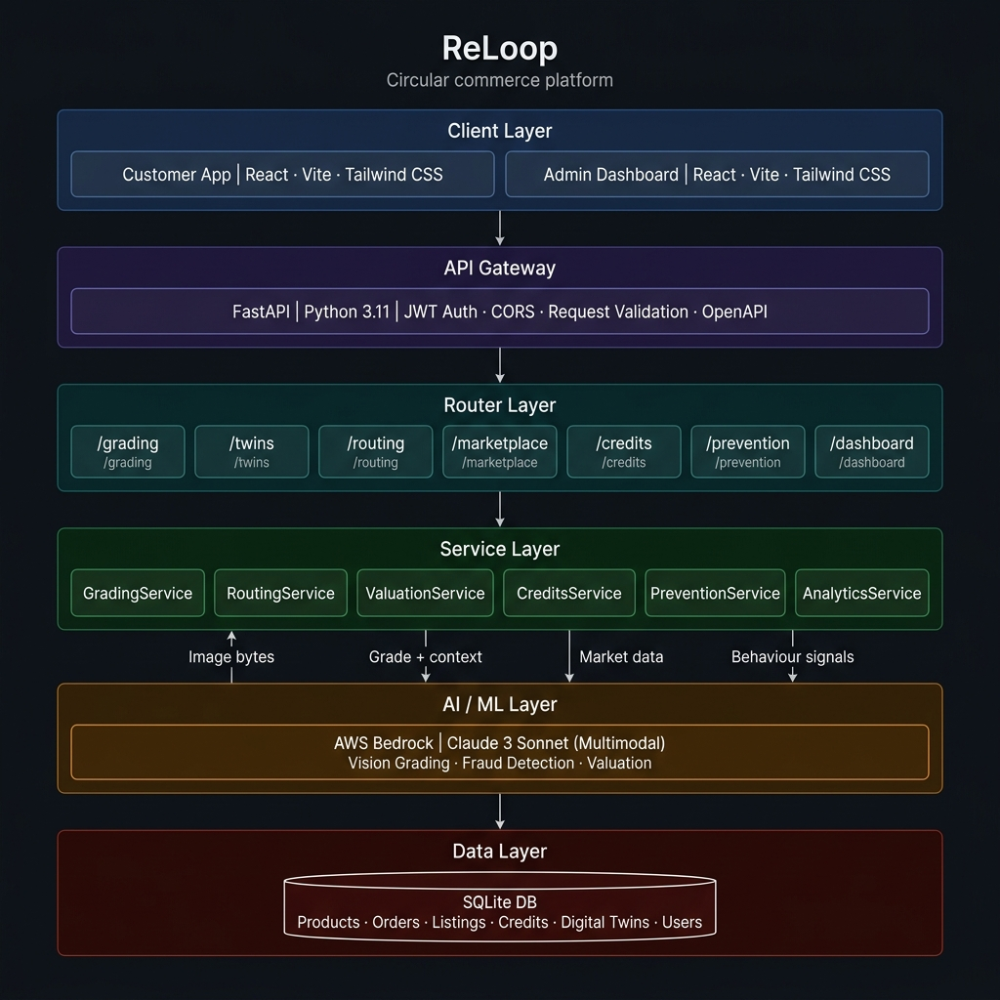
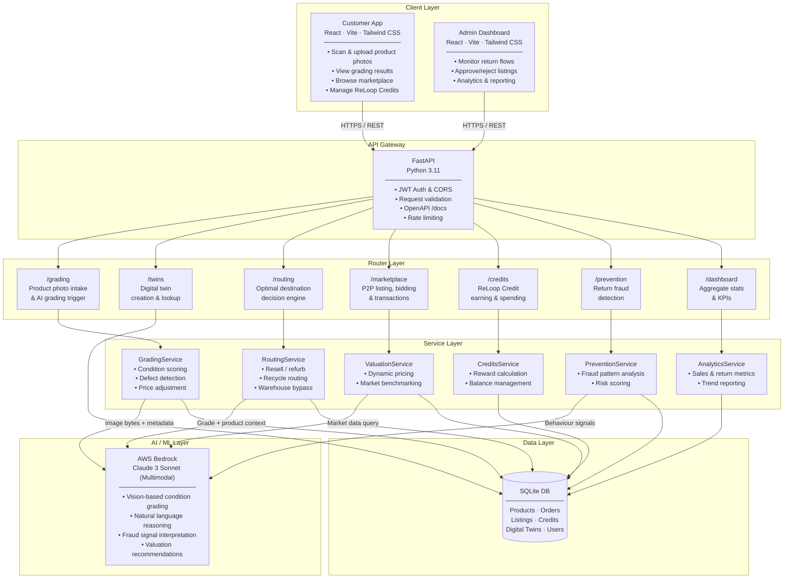

# ReLoop — Every Product Deserves a Second Life

**HackOn with Amazon Season 6 | Second Life Commerce**

**ReLoop** keeps the digital twin of a product alive via phone-camera grading, routes items optimally, and creates a trusted P2P resale ecosystem.

## Problem Statement
Returns are a "data death" problem. When a customer opens a product, its digital identity dies. Amazon spends billions moving items to warehouses just to re-identify them. 

## Solution
ReLoop uses the customer's phone camera to grade items at their location, then routes each item directly to its optimal destination — so every item travels once.

## Architecture

ReLoop is built on a modern, decoupled, multi-layered architecture — designed for scale, AI-powered automation, and a seamless circular commerce experience.







### Layer Responsibilities

| Layer | Technology | Responsibility |
|---|---|---|
| **Client** | React · Vite · Tailwind CSS | UI for customers (scan, resell, credits) and admins (monitoring, analytics) |
| **API Gateway** | FastAPI · Python 3.11 | Auth, request validation, routing, OpenAPI docs |
| **Routers** | FastAPI Routers | Domain-specific endpoints: grading, twins, routing, marketplace, credits, prevention, dashboard |
| **Services** | Python service classes | Business logic: grading, routing decisions, valuation, fraud prevention, analytics |
| **AI/ML** | AWS Bedrock · Claude 3 Sonnet | Multimodal vision grading, fraud analysis, dynamic valuation recommendations |
| **Database** | SQLite | Persistent storage for products, digital twins, marketplace listings, credits, users |


## Tech Stack
- **Frontend**: React + Vite + Tailwind CSS
- **Backend**: Python FastAPI + SQLite
- **AI/ML**: AWS Bedrock (Claude multimodal)

## Setup Instructions

### Backend
```bash
cd backend
python -m venv venv
source venv/bin/activate  # or `venv\Scripts\activate` on Windows
pip install -r requirements.txt
python -m seed_data.generate_synthetic
uvicorn app.main:app --reload --port 8000
```
API Documentation: [http://localhost:8000/docs](http://localhost:8000/docs)

### Frontend
```bash
cd frontend
npm install
npm run dev
```

## Demo
Launch both backend and frontend, then navigate to `http://localhost:3000` to walk through the customer experience and view the admin dashboard.

## Folder Structure
- `/contracts`: JSON schemas and API documentation
- `/backend`: FastAPI Python application
- `/frontend`: React customer and admin interfaces
- `/pitch`: Presentation deck and demo script